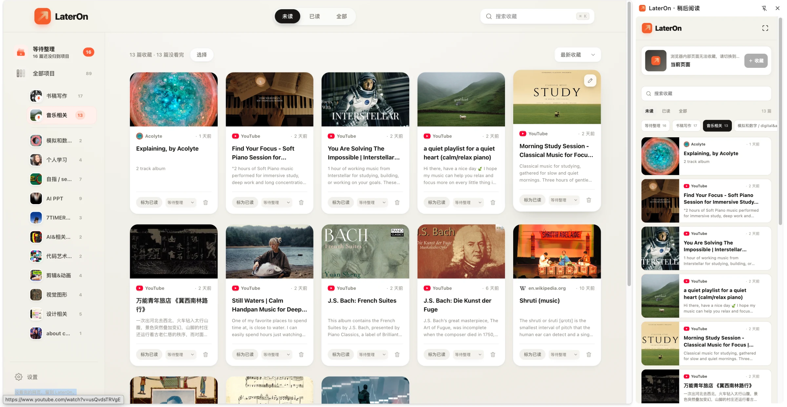

  

<h1 align="center">LaterOn</h1>

<strong>没看完的网页，留到 LaterOn。</strong>

  为经常在浏览器里积攒长文、视频和资料的人设计的本地优先稍后阅读扩展： 
  一键收藏、按项目整理，并在侧栏继续阅读。

## LaterOn 能做什么

| 一键收下 | 按项目整理 | 随时继续阅读 |
| --- | --- | --- |
| 按 `Alt+1` 收藏当前网页，按 `Alt+Shift+1` 收藏当前窗口的所有标签页。 | 收藏时选择项目，或者先放进“等待整理”；支持拖拽和多选移动。 | 在全屏界面管理，在浏览器侧栏阅读；再次打开网页时可以继续上次滚动位置。 |

LaterOn 会自动提取网页标题、摘要、封面和来源。已经打开的网页不会重复创建标签页，而是直接切换到现有页面。

## 1 分钟安装

LaterOn 目前通过开发者模式安装，支持 Chrome / Edge 121 及以上版本。

1. [下载项目 ZIP](https://github.com/gaoyiiiii/LaterOn/archive/refs/heads/main.zip) 并解压。
2. 打开 `chrome://extensions/`；Edge 使用 `edge://extensions/`。
3. 开启右上角的“开发者模式”。
4. 点击“加载已解压的扩展程序”，选择包含 `manifest.json` 的 `LaterOn-main` 文件夹。
5. 建议在扩展菜单中固定 LaterOn，点击图标即可打开侧栏。

## 日常使用

| 操作 | 方式 |
| --- | --- |
| 收藏当前网页 | `Alt+1`，或网页右键菜单 |
| 收藏当前窗口全部标签页 | `Alt+Shift+1` |
| 打开 LaterOn | 点击浏览器工具栏图标 |
| 搜索收藏 | 地址栏输入 `lo`，按空格后输入关键词 |
| 在新标签页打开 | `⌘/Ctrl + 点击`文章卡片，或使用卡片右键菜单 |

快捷键可以在 `chrome://extensions/shortcuts` 中重新设置。

## 核心体验

- **等待整理**：没想好放在哪里时先收藏，之后再统一归类。
- **全部项目首页**：用图板快速浏览所有项目，并直接新建项目。
- **侧栏阅读**：切换浏览器标签页时，LaterOn 会自动定位到当前收藏及其所属项目。
- **阅读状态**：区分未读、在读和已读；已读内容默认 30 天后自动清理，可在设置中调整。
- **继续上次位置**：重新打开读过的网页时，由你决定是否回到上次滚动位置。
- **批量处理**：多选后可移动、标记、删除，或在一个新窗口中打开。
- **中英文界面**：可以在设置中切换中文 / English。

## 数据与隐私

- 收藏、项目、阅读状态和设置保存在浏览器本地的 `chrome.storage.local` 中。
- LaterOn 不要求注册账号，也不会把收藏上传到 LaterOn 服务器。
- 可以在设置页中清空全部本地收藏数据。

## 常见问题

### 快捷键按下后没有反应

快捷键可能被系统或其他扩展占用。打开 `chrome://extensions/shortcuts`，为 LaterOn 换一个没有冲突的组合键。网页右键菜单不依赖快捷键，可以作为备用入口。

### 为什么有些页面不能收藏？

Chrome 内部页面、扩展商店、浏览器内置 PDF 查看器等受保护页面不允许扩展注入内容。请切换到普通的 `http://` 或 `https://` 网页后再试。

### “加载已解压的扩展程序”提示找不到清单

请选择解压后直接包含 `manifest.json` 的文件夹，而不是它的上一级目录。

### 更新后界面没有变化

回到 `chrome://extensions/`，找到 LaterOn 并点击“重新加载”，然后重新打开侧栏或完整界面。

### 侧栏出现在左边，能改到右边吗？

可以。侧栏方向由浏览器控制，在 Chrome 的“设置 → 外观 → 侧栏”中修改。
